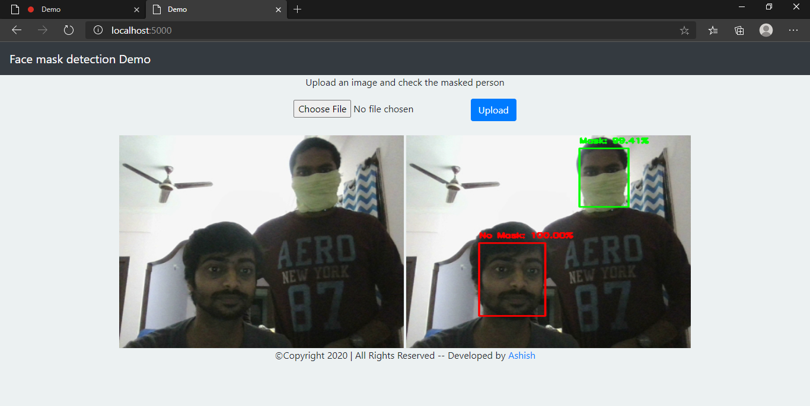
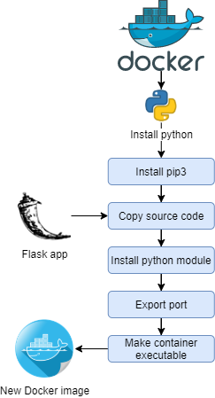

# <div align="center">Face mask detection application</div>

<div align="center">
<a href="https://github.com/ashishcssom/Face_Mask_Detection_end_to_end_project/stargazers"></a>
<a href="https://github.com/ashishcssom/Face_Mask_Detection_end_to_end_project/network/members"></a>
<a href="https://github.com/ashishcssom/Face_Mask_Detection_end_to_end_project/pulls"></a>
<a href="https://github.com/ashishcssom/Face_Mask_Detection_end_to_end_project/issues"></a>
<a href="https://github.com/ashishcssom/Face_Mask_Detection_end_to_end_project/graphs/contributors"></a>
</div>
## Demo
| | |
|---|---|
|||

## Project description

### Problem statement
The idea behind this project is to develop the web application to detect the face mask in an image. It should have the capability of identifying multiple person in an image with and without mask.
### Solution
A flask based application is developed utilizing the transfer learning concept to identify the person with or without mask in an image with high accuracy. Model is trained on Google colab ([model training code](https://github.com/ashishcssom/Face_Mask_Detection_end_to_end_project/blob/master/notebook/ModelTrainer.ipynb)) with following folder architecture.
```
├───Dataset
│   ├───without_mask
│   │       Snapshot.png
│   │
│   └───with_mask
│           Snapshot (1).png    
└───ModelTrainer.ipynb 
```
All the [dataset](https://drive.google.com/drive/folders/1QI_O0soGWn0jzm6mFKnhVh4OkKCb-_Nn?usp=sharing) are splitted into model train, validation and testing data which constitutes are 3187, 683 and 684 images respectively. The training, validation and testing accuracy are 97%, 93% and 95% respectively.

|Training performance|Validation performance|Testing performance|
|---|---|---|
||||


## Directory structure
```
D:.
│   app.py
│   Aptfile
│   config.py
│   Engine.py
│   LICENSE
│   MainAPI.bat
│   Procfile
│   README.md
│   requirements.txt
│   runtime.txt
│
├───dataset
│   ├───without_mask
│   │       Snapshot.png
│   │
│   └───with_mask
│           Snapshot (1).png     
│
├───log
│       DemoImage.png
│       MainAPIlog.log
│
├───models
│       deploy.prototxt
│       model
│       res10_300x300_ssd_iter_140000.caffemodel
│
├───notebook
│       ModelTester.ipynb
│       ModelTrainer.ipynb
│
├───static
│   ├───downloads
│   │       Snapshot.png
│   │
│   └───uploads
│           Snapshot.png
│
└───templates
        index.html
        WebSnapshot.html
```

## Instruction to install the application in local machine

1. Install Anaconda from this link https://www.anaconda.com/products/individual#windows and follow the steps mentioned in following link
https://docs.anaconda.com/anaconda/install/windows/

2. After Anaconda installation, go to search and run Anaconda Prompt and create virtual environment using following commands.

`conda create -n FaceDetect python=3.7 anaconda`

`conda activate FaceDetect`

3. Run Anaconda prompt and change the drive to the location of manual folder and run command `pip install -r requirements.txt`. This will install all the packages require for model execution.
```
(base) C:\Users\imash>conda activate FaceDetect
(FaceDetect) C:\Users\imash>
(FaceDetect) C:\Users\imash>pip install -r requirements.txt 
```
4. MainAPI.bat is Batch file for easy start of server and it can be used as schedular. In this file, modify the line number 5 and 6 for the location of activate.bat in base and python.exe in virtual environment. To run the server in your local, just hit MainAPI.bat file.
```
@echo off
SET LOGFILE="%~dp0\log\MainAPIlog.log"
(echo====================================================================================================== >> %LOGFILE%)
(echo Script Start Running at - ^ %date% %time% >> %LOGFILE%)
call "C:\ProgramData\Anaconda3\Scripts\activate.bat"
"C:\Users\imash\.conda\envs\FaceDetection\python.exe" "%~dp0\app.py"
(echo Script Successfully Executed at - ^ %date% %time% >> %LOGFILE%)
(echo====================================================================================================== >> %LOGFILE%)
pause
```

## Application deployment in Heroku
Following three files are necessary if user want to publish this developed application in Heroku. As Heroku support max files size of 500mb including libraries and project size is more than that so, it does not deployed in Heroku successfully.
1. Procfile — This specifies the commands to be executed by Heroku’s server by the app on startup.
2. requirements.txt — This contains the list of modules in your virtual environment it can be gotten by executing in your terminal .
3. runtime.txt — Used to specify the python version to be run of the server

## Dockerizing the software

<div align="center"></div>

Official Docker [documentation](https://docs.docker.com/get-started/)


## Credit
[PyImageSearch](https://www.pyimagesearch.com/)

Chandrika deb [github link](https://github.com/chandrikadeb7)

## License

[](https://github.com/ashishcssom/Face_Mask_Detection_end_to_end_project/blob/master/LICENSE)
```
Copyright (c) 2020 Ashish Kumar
```

## Contact
[](https://www.linkedin.com/in/ashishk766/) 
[](mailto:ashish.krb7@gmail.com) 
